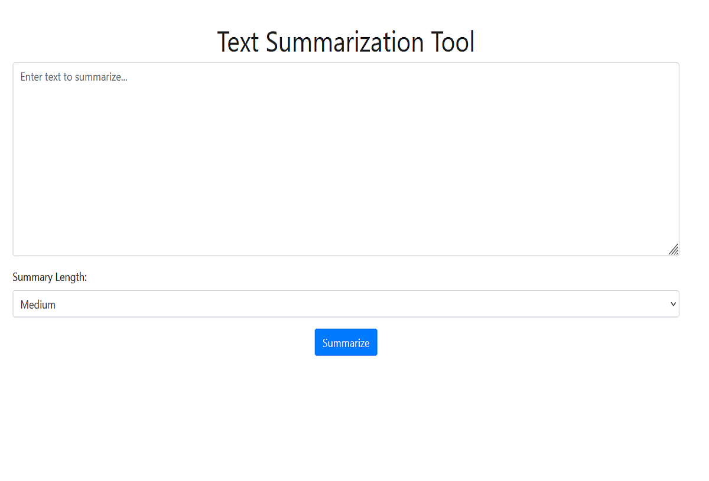
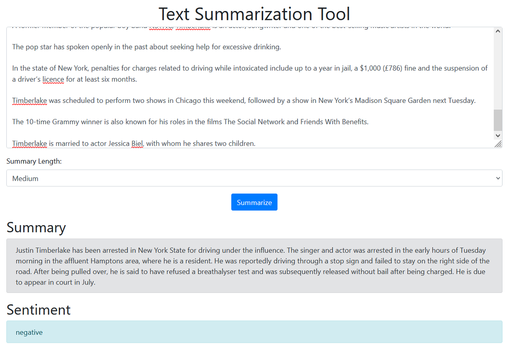
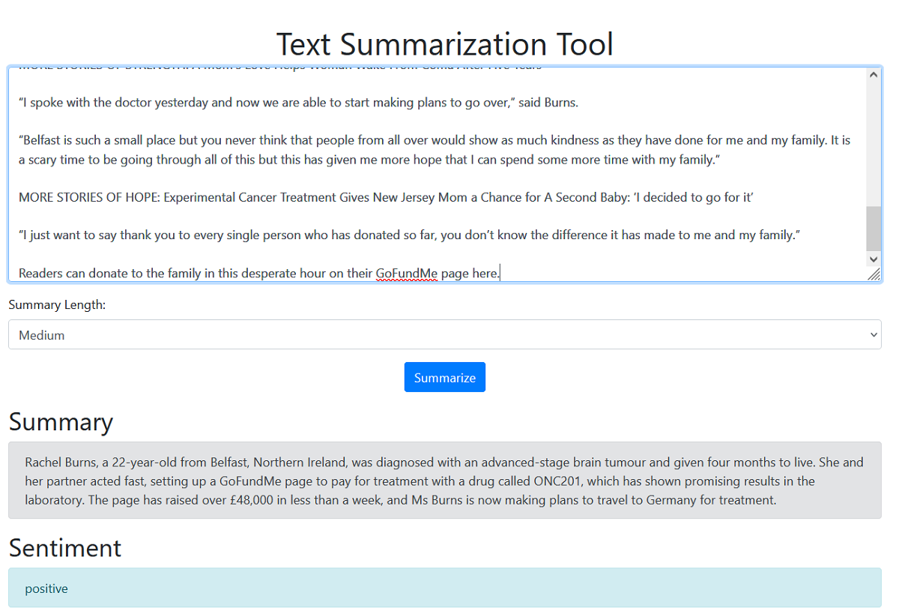
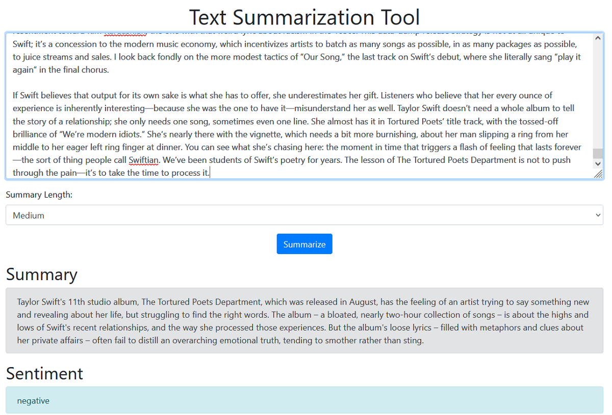

# Text Summarization Tool

This project is a simple web-based text summarization tool built using Flask and Cohere's NLP models.

## Features

- Summarize text with adjustable length options (short, medium, long)
- Sentiment analysis of the summarized text
- Responsive design with Bootstrap

## Demo






## Installation

```bash
git clone https://github.com/HaileyTQuach/text-summarizer.git
cd text-summarization-tool
python -m venv venv
source venv/Scripts/activate  # On Windows, use `venv\Scripts\activate`
pip install -r requirements.txt
